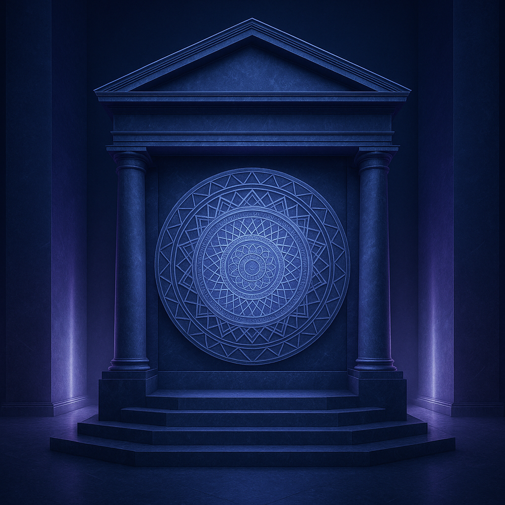

# Image Generation Prompts for mrcampbell.org

Professional Fortune 100 consulting website imagery - Abstract only, NO humans.

**Color Palette:** Navy (#1a2b4a), Purple (#5e3a8f, #7c3aed), Blue (#2563eb, #3b82f6)

---

## 1. HERO SECTION - AI Security & Threat Mitigation

### Primary Prompt (Midjourney)
```
Abstract visualization of AI security architecture, layered hexagonal shields made of flowing blue and purple digital particles, cybersecurity defense mesh network, geometric protection barriers intercepting streams of red threat vectors, depth of field with glowing neural network patterns in background, professional corporate technology aesthetic, dark navy gradient backdrop, volumetric lighting through translucent security layers, 8k photorealistic render, clean modern composition --ar 16:9 --style raw --v 6 --q 2 --no people, humans, faces, figures, persons, characters, man, woman, silhouettes, bodies
```

### Alternative Approach
```
Sophisticated abstract fortress concept, concentric rings of luminous navy and deep purple energy barriers, digital threat streams fragmenting against protective shields, flowing particle systems representing AI defense mechanisms, crystalline geometric structures, enterprise technology visualization, minimal clean aesthetic, cool color temperature, cinematic lighting, ultra sharp detail --ar 16:9 --style raw --v 6 --q 2 --no people, humans, faces, figures, persons, silhouettes
```

### DALL-E 3
- **Size:** 1792x1024 (landscape)
- **Style:** Natural
- **Prompt:** Use primary prompt + "No humans, no people, no faces, no figures, no silhouettes, abstract only"

### Stable Diffusion
- **Negative prompt:** `people, humans, faces, person, man, woman, figure, silhouette, character, body, anthropomorphic, humanoid, portrait`
- **Size:** 1920x1080
- **Sampling:** DPM++ 2M Karras, Steps: 40-50, CFG: 7-8

**Usage:** 1920x1080 minimum, hero banner, text overlay safe in center 60%

---

## 2. LEAD MAGNET - Assessment Framework Visualization

### Primary Prompt (Midjourney)
```
Professional business consulting framework visualization, three-dimensional checklist matrix floating in space, glowing connection lines between assessment nodes, navy blue and purple gradient color scheme, isometric perspective, clean organized grid structure, digital checkmarks materializing, enterprise documentation aesthetic, subtle depth of field, modern minimalist composition, crisp lighting, corporate sophistication --ar 3:2 --style raw --v 6 --q 2 --no people, humans, faces, figures, persons, hands, silhouettes
```

### Alternative Approach
```
Abstract methodology flowchart, interconnected assessment modules represented as translucent geometric cubes with internal glowing circuits, systematic evaluation pathways shown as light trails connecting nodes, professional blue-purple palette, structured orderly layout, consulting deliverable aesthetic, clean background with subtle grid, technical precision, photorealistic render --ar 3:2 --style raw --v 6 --q 2 --no people, humans, faces, hands
```

### DALL-E 3
- **Size:** 1792x1024 or 1024x1024
- **Style:** Natural
- **Emphasis:** "Professional consulting framework, no people, abstract geometric structures only"

### Stable Diffusion
- **Negative prompt:** `people, humans, faces, hands, person, figure, silhouette, character, anthropomorphic, humanoid`
- **Positive add:** `technical diagram, professional consulting, enterprise aesthetic`
- **Size:** 1536x1024 or 1024x1024

**Usage:** 1200x800 or square 1200x1200, content section with text alongside

---

## 3. GOVERNMENT RECOGNITION - Institutional Credibility

### Primary Prompt (Midjourney)
```
Abstract representation of institutional authority and government validation, monumental geometric architecture with classical proportions rendered in modern navy and purple materials, official seal-like circular mandala patterns with precise symmetry, marble and metal textures, pillars of light representing pillars of credibility, prestigious atmosphere, depth and gravitas, professional lighting, photorealistic materials, no text or specific symbols --ar 4:3 --style raw --v 6 --q 2 --no people, humans, faces, text, letters, words, specific seals, flags, national symbols
```

### Alternative Approach
```
Sophisticated abstract credentialing concept, premium metallic badge-like circular structure floating in dimensional space, layered rings of authority with precision-cut edges, deep navy and royal purple materials with gold accents, official government aesthetic without specific emblems, volumetric god rays, prestigious institutional feeling, ultra-detailed render, professional gravitas --ar 4:3 --style raw --v 6 --q 2 --no people, humans, faces, text, letters
```

### DALL-E 3
- **Size:** 1024x1024 (square)
- **Style:** Natural
- **Specify:** "Abstract geometric patterns only, no text, no specific government seals, no people"

### Stable Diffusion
- **Negative prompt:** `people, humans, text, letters, words, specific emblems, flags, logos, faces, figures`
- **Positive:** `abstract authority, institutional gravitas, geometric precision`
- **Size:** 1024x1024

**Usage:** Square 1000x1000 or 1200x1200, centered with text below

---

## 4. OPERATOR VS CONSULTANT - Practical Expertise

### Primary Prompt (Midjourney)
```
Split-screen abstract comparison concept, left side showing theoretical blueprints and diagrams floating as holograms in purple tones, right side displaying solid constructed technological infrastructure in deep navy with tangible metal and circuitry, clear visual division down center, contrast between planning versus execution, tools and built systems, practical versus advisory, professional corporate aesthetic, balanced composition, photorealistic materials --ar 16:9 --style raw --v 6 --q 2 --no people, humans, hands, faces, figures, silhouettes, workers, engineers
```

### Alternative Approach
```
Abstract diptych visualization, transparent fragile geometric wireframes on one half versus robust solid engineered structures on other half, navy and purple color coding for differentiation, concept of hands-on building versus consultation, mechanical components and infrastructure versus planning documents, clear distinction, professional technology aesthetic, cinematic lighting, sharp detail --ar 16:9 --style raw --v 6 --q 2 --no people, humans, hands, faces
```

### DALL-E 3
- **Size:** 1792x1024 (landscape)
- **Style:** Natural
- **Emphasize:** "Abstract comparison, no humans, left vs right visual split, geometric and architectural elements only"

### Stable Diffusion
- **Negative prompt:** `people, humans, hands, faces, workers, silhouettes, figures, characters, anthropomorphic`
- **Positive:** `split composition, comparison visualization, left right divide, abstract contrast`
- **Size:** 1920x1080

**Usage:** 1600x900 minimum, feature section with vertical/horizontal split, can add labels

---

## 5. REGULATORY URGENCY - Compliance Deadlines

### Primary Prompt (Midjourney)
```
Abstract time pressure visualization, circular countdown clock made of flowing digital particles in urgent orange-red transitioning to navy blue, regulatory document streams converging toward central point, calendar grid dissolving into urgency, geometric deadline representation, professional anxiety without chaos, controlled tension, corporate compliance aesthetic, dynamic motion blur, premium render quality, dark background with strategic lighting --ar 3:2 --style raw --v 6 --q 2 --no people, humans, faces, figures, stressed persons, workers, silhouettes
```

### Alternative Approach
```
Sophisticated urgency concept, hourglass-inspired abstract form with regulatory data streams flowing through narrowing passage, time-sensitive visualization in navy and deep red accent colors, deadline horizon approaching, layered calendar planes stacking with intensity, professional pressure representation, clean composition despite urgency theme, photorealistic particle systems, enterprise aesthetic --ar 3:2 --style raw --v 6 --q 2 --no people, humans, faces
```

### DALL-E 3
- **Size:** 1792x1024 or 1024x1024
- **Style:** Natural
- **Note:** "Abstract time and urgency concept, no people, no faces, geometric and particle-based only"

### Stable Diffusion
- **Negative prompt:** `people, humans, faces, stressed people, workers, figures, silhouettes, characters`
- **Positive:** `abstract urgency, time pressure, deadline visualization, professional tension`
- **Size:** 1536x1024

**Usage:** 1200x800 or 1400x933, content section with CTA, warmer accent colors (orange/amber) for urgency

---

## 6. ENGAGEMENT MODELS - Strategic Collaboration Tiers

### Primary Prompt (Midjourney)
```
Three-tiered abstract business structure visualization, layered platforms ascending in sophistication, each tier represented by distinct geometric architecture in navy to purple gradient, connection pathways between levels showing progression, professional service hierarchy, modular engagement concept, clean organized composition, isometric or slight perspective view, premium materials, corporate collaboration aesthetic, precise lighting, photorealistic quality --ar 16:9 --style raw --v 6 --q 2 --no people, humans, faces, figures, business people, handshakes, meetings, silhouettes
```

### Alternative Approach
```
Abstract tiered service model, three distinct zones arranged vertically or as ascending steps, each level with unique geometric complexity increasing in detail, interconnected but distinct engagement modules, navy blue foundation tier, mid-level purple strategic tier, premium top tier with sophisticated details, professional consulting packages visualization, clean modern composition, enterprise aesthetic --ar 16:9 --style raw --v 6 --q 2 --no people, humans, faces
```

### DALL-E 3
- **Size:** 1792x1024 or 1024x1024
- **Style:** Natural
- **Specify:** "Three-tiered abstract structure, no people, geometric levels, professional hierarchy visualization"

### Stable Diffusion
- **Negative prompt:** `people, humans, faces, business people, professionals, handshakes, meetings, figures, silhouettes`
- **Positive:** `three tier structure, hierarchical levels, service tiers, modular architecture, professional packages`
- **Size:** 1536x1024 or 1024x1024

**Usage:** 1400x900 or square 1200x1200, pricing/services section, three clear zones for labels

---

## QUICK REFERENCE

| Image | Concept | Aspect Ratio | Dimensions | Mood |
|-------|---------|--------------|------------|------|
| **1. Hero** | AI Security Shield | 16:9 | 1920x1080 | Protected, Sophisticated |
| **2. Lead Magnet** | Assessment Matrix | 3:2 | 1200x800 | Organized, Professional |
| **3. Government** | Institutional Authority | 4:3 | 1200x1200 | Prestigious, Credible |
| **4. Comparison** | Built vs Advised | 16:9 | 1600x900 | Contrasting, Clear |
| **5. Regulatory** | Deadline Urgency | 3:2 | 1200x800 | Pressing, Controlled |
| **6. Engagement** | Three-Tier Services | 16:9 | 1400x900 | Structured, Scalable |

---

## UNIVERSAL NEGATIVE PROMPTS

Always exclude across all platforms:
- People, humans, faces, figures, silhouettes, persons, characters
- Hands, body parts, anthropomorphic elements
- Specific company logos, branded elements
- Text, letters, words (unless background texture)
- Cartoon/illustration style

---

## WORKFLOW TIPS

1. **Generate 2-3 variations** per prompt to select best fit
2. **Test with text overlays** on actual website sections
3. **Optimize file size** to <300KB for web performance
4. **Verify mobile responsive** appearance at various breakpoints
5. **Check accessibility** - ensure sufficient contrast for overlaid text

## WHERE TO PLACE IMAGES

Once generated, save images in website directory and reference in HTML:

```html
<!-- Hero Section -->
<section style="background-image: url('hero-ai-security.jpg')">

<!-- Lead Magnet Section -->


<!-- Government Recognition -->


<!-- Operator Comparison -->


<!-- Regulatory Urgency -->


<!-- Engagement Models -->

```
